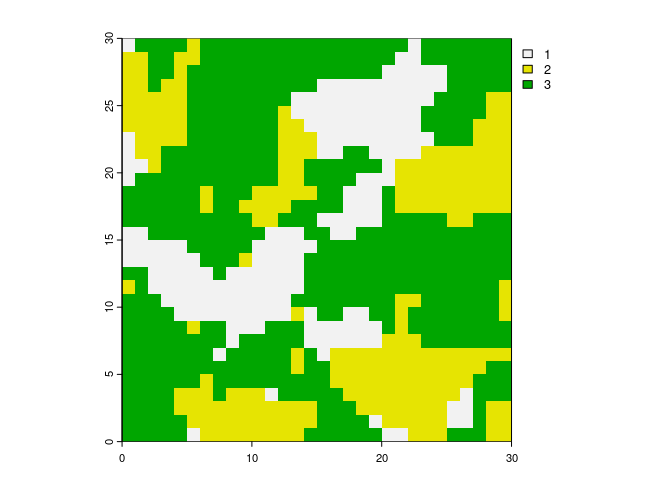

## Overview

**landscapemetrics** is a `R` package for calculating landscape metrics
for categorical landscape patterns in a tidy workflow. The package can
be used as a drop-in replacement for FRAGSTATS (McGarigal *et al.*
2023), as it offers a reproducible workflow for landscape analysis in a
single environment. It also allows for calculations of four theoretical
metrics of landscape complexity: a marginal entropy, a conditional
entropy, a joint entropy, and a mutual information (Nowosad and
Stepinski 2019).

**landscapemetrics** supports **terra**, and **stars** and takes
`SpatRaster` or `stars` spatial objects as input arguments. Every
function can be used in a piped workflow, as it always takes the data as
the first argument and returns a `tibble`.

## Installation

There are several ways to install **landscapemetrics**:

``` r
# Get the stable version from CRAN
install.packages("landscapemetrics")

# Alternatively, you can install the development version from Github
# install.packages("remotes")
remotes::install_github("r-spatialecology/landscapemetrics")
```

#### Announcement

Due to an improved connected-component labelling algorithm
(**landscapemetrics** v1.4 and higher), patches are labeled in a
different order than before and therefore different patch IDs might be
used compared to previous versions. However, results for all metrics are
identical.

## Using landscapemetrics

The resolution of a raster cell has to be in **meters**, as the package
converts units internally and returns results in either meters, square
meters or hectares. Before using **landscapemetrics**, be sure to check
your raster (see `check_landscape()`).

All functions in **landscapemetrics** start with `lsm_` (for
**l**and**s**cape **m**etrics). The second part of the name specifies
the level (patch - `p`, class - `c` or landscape - `l`). The last part
of the function name is the abbreviation of the corresponding metric
(e.g. `enn` for the euclidean nearest-neighbor distance):

    # general structure
    lsm_"level"_"metric"

    # Patch level
    ## lsm_p_"metric"
    lsm_p_enn()

    # Class level
    ## lsm_c_"metric"
    lsm_c_enn()

    # Landscape level
    ## lsm_p_"metric"
    lsm_l_enn()

All functions return an identical structured tibble:

| layer | level     | class | id  | metric           | value |
|-------|-----------|-------|-----|------------------|-------|
| 1     | patch     | 1     | 1   | landscape metric | x     |
| 1     | class     | 1     | NA  | landscape metric | x     |
| 1     | landscape | NA    | NA  | landscape metric | x     |

### Using metric functions

Every function follows the same implementation design, so the usage is
quite straightforward:

``` r
library(landscapemetrics)
library(terra)

# internal data needs to be read
landscape <- terra::rast(landscapemetrics::landscape)

# landscape raster
plot(landscape)
```



``` r

# calculate for example the Euclidean nearest-neighbor distance on patch level
lsm_p_enn(landscape)
#> # A tibble: 28 × 6
#>    layer level class    id metric value
#>    <int> <chr> <int> <int> <chr>  <dbl>
#>  1     1 patch     1     1 enn     7   
#>  2     1 patch     1     2 enn     4   
#>  3     1 patch     1     3 enn     2   
#>  4     1 patch     1     4 enn     6.32
#>  5     1 patch     1     5 enn     5   
#>  6     1 patch     1     6 enn     2.24
#>  7     1 patch     1     7 enn     2   
#>  8     1 patch     1     8 enn     4.12
#>  9     1 patch     1     9 enn     4.12
#> 10     1 patch     2    10 enn     4.47
#> # ℹ 18 more rows

# calculate the total area and total class edge length
lsm_l_ta(landscape)
#> # A tibble: 1 × 6
#>   layer level     class    id metric value
#>   <int> <chr>     <int> <int> <chr>  <dbl>
#> 1     1 landscape    NA    NA ta      0.09
lsm_c_te(landscape)
#> # A tibble: 3 × 6
#>   layer level class    id metric value
#>   <int> <chr> <int> <int> <chr>  <dbl>
#> 1     1 class     1    NA te       181
#> 2     1 class     2    NA te       203
#> 3     1 class     3    NA te       296
```

There is also a wrapper around every metric in the package to quickly
calculate a bunch of metrics:

``` r
# calculate all metrics on patch level
calculate_lsm(landscape, level = "patch")
#> Warning: Please use 'check_landscape()' to ensure the input data is valid.
#> # A tibble: 336 × 6
#>    layer level class    id metric  value
#>    <int> <chr> <int> <int> <chr>   <dbl>
#>  1     1 patch     1     1 area   0.0001
#>  2     1 patch     1     2 area   0.0005
#>  3     1 patch     1     3 area   0.0072
#>  4     1 patch     1     4 area   0.0001
#>  5     1 patch     1     5 area   0.0001
#>  6     1 patch     1     6 area   0.008 
#>  7     1 patch     1     7 area   0.0016
#>  8     1 patch     1     8 area   0.0003
#>  9     1 patch     1     9 area   0.0005
#> 10     1 patch     2    10 area   0.0034
#> # ℹ 326 more rows
```

### Utility functions

**landscapemetrics** further provides several visualization functions,
e.g. show all labeled patches or the core area of all patches. All
visualization functions start with the prefix `show_`
(e.g. `show_cores()`).

Important building blocks of the package are exported to help facilitate
analysis or the development of new metrics. They all start with the
prefix `get_`. All of them are implemented with Rcpp and have either
memory or performance advantages compared to raster functions.

For more details, see the `vignette("utility")`.
